# Reusable web components in VUE JS 

# Install
> You can get the project and run yarn install, a demo page will run
> To use this components in your project run yarn add 

# Table with header 
 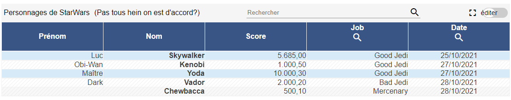

 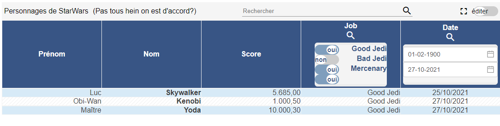

 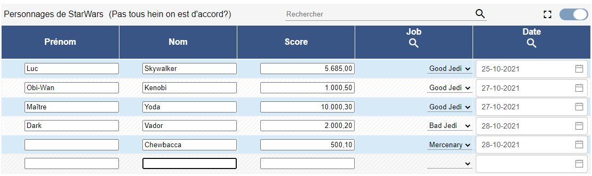
 

 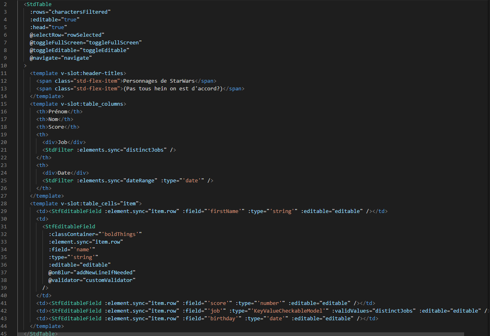

# Treetable 
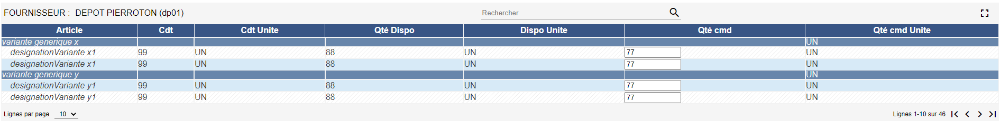

# Flat with Treetable aspect
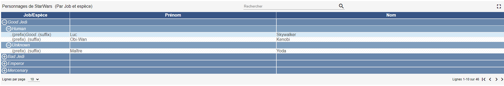

# Editable Fields
> A date with datepicker
  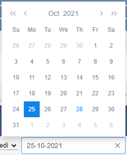
  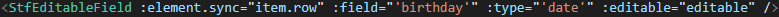

> Valid values in combo
  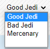
  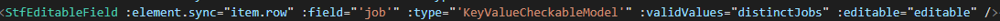

> A number with dynamic debounce
  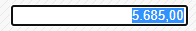
  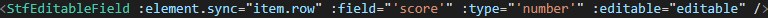

> Rounded element
  

> Toggle button
  

> Buttons
   
   `<StdButton :icon="StdIconStyle.load" :backgroundColor="StdPastilleStyle.pastilleColorEabc" text="refresh" @click="echoClick" />` 

> SVG Spinner
  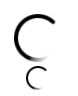
  `<StdSpinner size="48" /><StdSpinner />`

> tooltips inline or absolute with buttons
  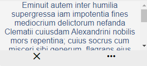

> fix header for tables
  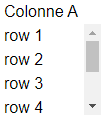

> toasted event
  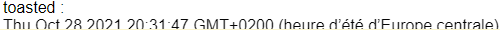
  `<StdToasted :text="toasted"></StdToasted>`

> expender 
   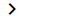

> filter 
   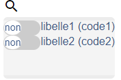
   `<StdFilter :elements="elementsToFilter"></StdFilter>`

> pagination
  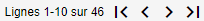
  ``

> full text search 
  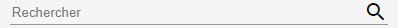

 [> LE DORNER François](https://www.francoisledorner.fr)