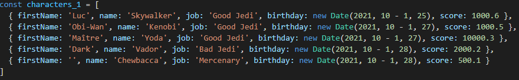

# Reusable web components in VUE JS 

# Install
> You can get the project and run `yarn install` , a demo page will run

or

> To use this components in your project run 
`yarn add webcomponents-dl@0.1.42`

# Table with header 
## Exemple with simple model

## Read only mode
 

## Filters in columns
 

## Edit mode 
 

## Composition with simples components
 

# Treetable 
> Usefull for aggregates columns and explore partials branches

# Flat with Treetable aspect
> Usefull for display groups

----------
# Reusable Components

## Component - Editable Field - Datepicker
> A date with datepicker
  
  

----------
## Component - Editable Field - Combo
> Valid values in combo
  
  

----------
## Component - Editable Field -  Number, String ...
> A number with dynamic debounce
  
  

----------
## Component - Pastille
> Rounded element
  

----------
## Component - Toggle
> Toggle button
  

----------
## Component - Buttons
> Buttons can be an image or anything else
  
----------

## Component - Spinner
> Reactive SVG Spinner
   

----------
## Component - Tooltips
> tooltips inline or absolute with buttons
  
----------

## Component - Fixed 
> fix header for different uses : for tables ...
  

----------
## Component - Toasted
> toasted event
  
----------

## Component - Expender
> expender 
   
----------

## Component - Filter
> Reactive filter
   
  
----------

## Component - pagination
> pagination
  
 
----------

## Component - Search field
> full text search 
  
----------
 [> LE DORNER François](http://francoisledorner.fr)